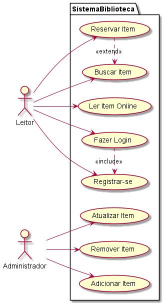
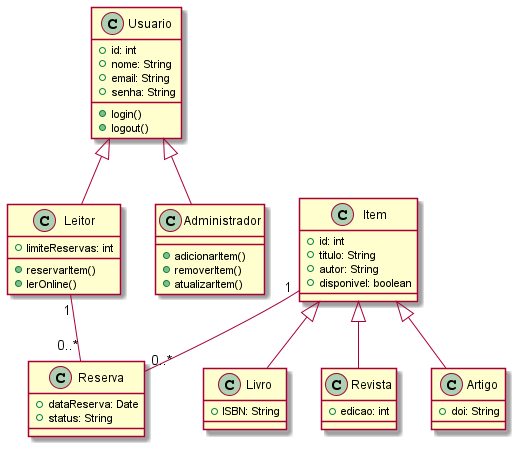
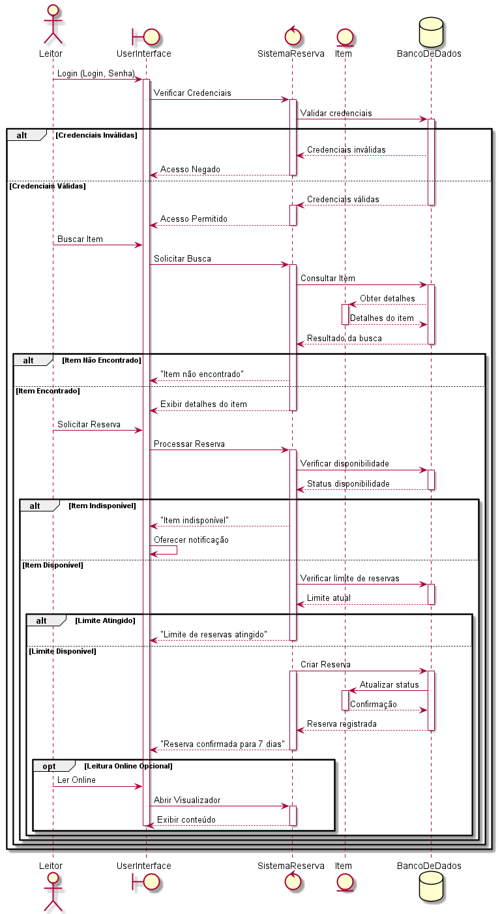

# Exercicio Biblioteca Digital
### **Descrição do Sistema:**
A biblioteca digital é um repositório online de livros, revistas e artigos. Usuários podem se registrar, buscar conteúdo, ler online e fazer reservas de determinados itens para leitura offline. Há dois tipos principais de usuários: **leitores** e **administradores**. Os administradores são responsáveis por **adicionar**, **atualizar** ou **remover** itens do catálogo da biblioteca.  
**Requisitos:**
* Usuários devem se registrar e fazer login para acessar os recursos.
* Leitores podem buscar itens por título, autor ou categoria.
* Leitores podem ler itens online. Leitores podem reservar itens para leitura offline.
* Administradores podem adicionar novos itens ao catálogo.
* Administradores podem atualizar ou remover itens existentes.

1. **Diagrama de Caso de Uso:** Identifique os atores principais (Leitores, Administradores). Represente os casos de uso associados a cada ator (ex: "Buscar Item", "Adicionar Item ao Catálogo").

# **Caso de Uso Textual:**

- **Nome do Caso de Uso**: Sistema Biblioteca
- **Ator Principal**: Leitor
- **Atores Secundários**: Administrador

**Descrição:** Permite que um **Leitor** reserve um item (livro, revista ou artigo) para leitura (offline ou Online) após encontrá-lo no catálogo.

**Pré-Condições**:
Leitor está autenticado no sistema (`Fazer Login`). Item desejado está disponível no catálogo.

**Passos**:
   1. O Leitor **busca o item** (`Buscar Item`) por título, autor ou categoria.
   2. O sistema exibe os resultados da busca.
   3. O Leitor seleciona o item e escolhe a opção **"Reservar"**.
   4. O sistema verifica a disponibilidade do item.
   5. Se disponível, o sistema registra a reserva e atualiza o status do item para "Reservado".
   6. O sistema notifica o Leitor: *"Reserva confirmada para [Item]."*

**Pós-Condições**: O item fica indisponível para outros Leitor durante o período de reserva. A reserva é vinculada à conta do Leitor.

#### **Fluxos Alternativos**
- **Alternativa 1 (Item Indisponível)**:
  - Se o item já estiver reservado, o sistema exibe: *"Item indisponível para reserva no momento."*
  - O Leitor pode optar por ser notificado quando o item estiver disponível.

- **Alternativa 2 (Limite de Reservas Atingido)**:
  - Se o Leitor já tiver atingido seu limite de reservas, o sistema exibe: *"Limite de reservas atingido. Libere itens para novas reservas."*

#### **Exceções**
- **Exceção 1 (Falha na Autenticação)**:
  - Se o Leitor não estiver logado, o sistema redireciona para `Fazer Login`.

- **Exceção 2 (Erro no Sistema)**:
  - Se houver falha ao registrar a reserva, o sistema exibe: *"Erro ao processar reserva. Tente novamente."*

#### **Relacionamentos**
- **Inclusão (`«include»`)**:
  - `Reservar Item` depende de `Buscar Item` para localizar o item desejado.
- **Extensão (`«extend»`)**:
  - `Reservar Item` pode estender `Ler Item Online` se o Leitor optar por ler online antes de reservar.

#### **Exemplo**
**Cenário**:
- Leitor João busca o livro *"Dom Casmurro"*.
- O sistema lista o livro como disponível.
- João clica em "Reservar" e recebe a confirmação: *"Dom Casmurro reservado para leitura offline por 7 dias."*

2. **Diagrama de Classes:** Identifique as classes principais (ex: Usuario,
Leitor, Administrador, Item, Livro, Revista, Artigo). Represente a relação de herança entre as classes (ex: Leitor e Administrador herdam de Usuario). Estabeleça relações como associações e composições entre as classes (ex: um Leitor pode ter várias Reservas). Adicione atributos básicos e métodos pertinentes para as classes.

3. **Diagrama de Sequência:** Escolha um dos principais requisitos (ex: "Leitores reservam um item para leitura offline"). Ilustre a interação entre os objetos para satisfazer o caso de uso selecionado. Garanta que todos os passos envolvidos na interação estejam claramente representados.
