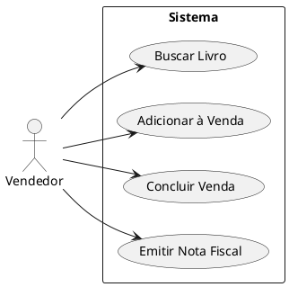
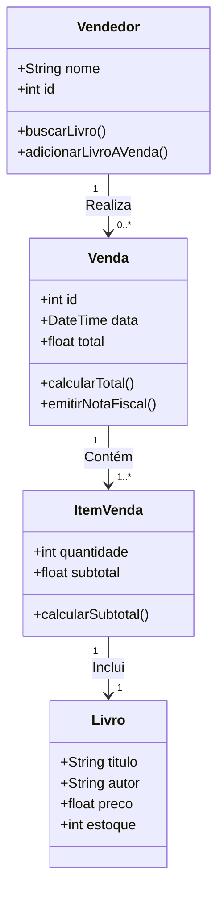
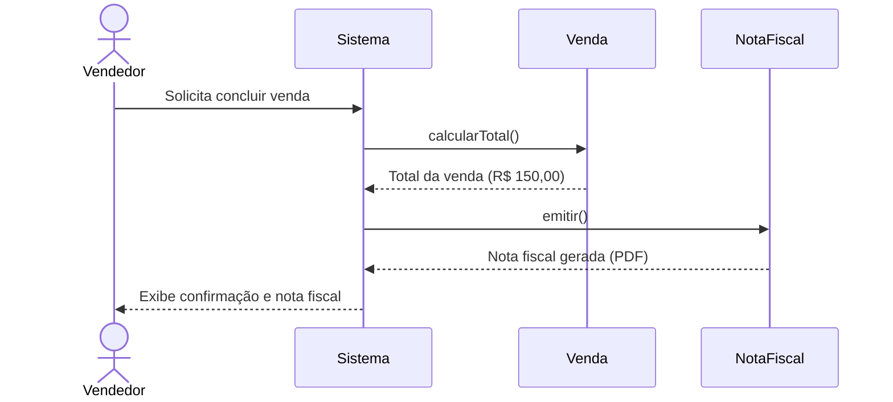

# Sistema de Vendas Simples
**Requisitos básicos:**  
O vendedor pode buscar um livro pelo título ou autor.  
O sistema lista os livros que atendem aos critérios da busca.  
O vendedor seleciona um livro e informa a quantidade vendida.  
O sistema adiciona o livro à venda atual e mostra o subtotal.  
O vendedor pode repetir os passos 1-4 para adicionar mais livros à venda.  
O vendedor conclui a venda e o sistema calcula o total.  
O sistema emite uma nota fiscal para o cliente.  
### Tarefa 1: Diagrama de Caso de Uso 
Desenhe um diagrama de caso de uso representando as operações descritas nos requisitos básicos.

### Tarefa 2: Diagrama de Classes
Identifique as classes envolvidas neste sistema e suas relações e crie um diagrama de classes. Lembre-se de considerar atributos e métodos básicos para as classes.

### Tarefa 3: Diagrama de Sequência
Escolha uma das operações (por exemplo, "Concluir Venda") e ilustre-a usando um diagrama de sequência. Garanta que a interação entre os objetos e os atores esteja claramente representada.
