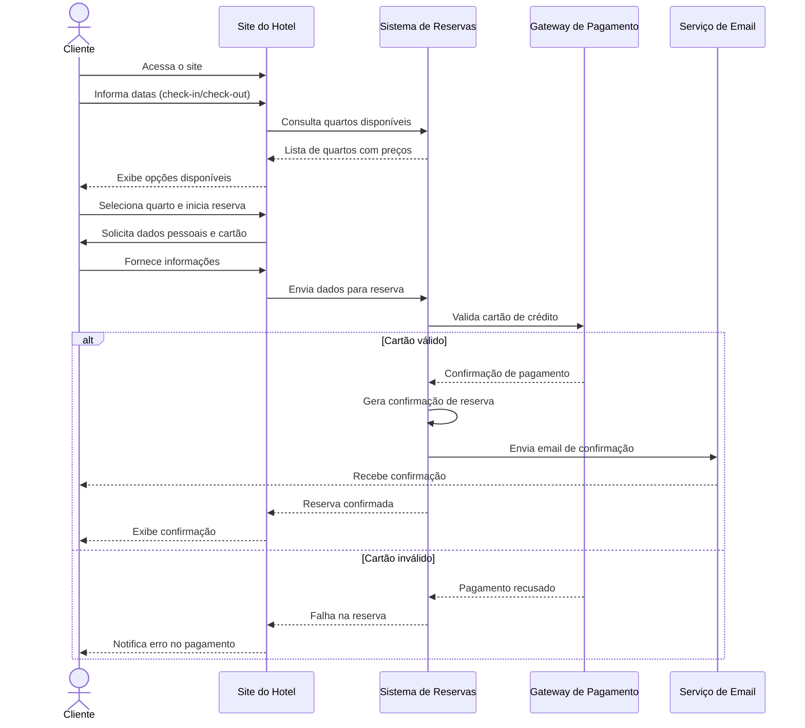

```mermaid
sequenceDiagram
    actor Cliente as Cliente
    participant Site as Site do Hotel
    participant Sistema as Sistema de Reservas
    participant Banco as Gateway de Pagamento
    participant Email as Serviço de Email

    Cliente->>Site: Acessa o site
    Cliente->>Site: Informa datas (check-in/check-out)
    Site->>Sistema: Consulta quartos disponíveis
    Sistema-->>Site: Lista de quartos com preços
    Site-->>Cliente: Exibe opções disponíveis
    Cliente->>Site: Seleciona quarto e inicia reserva
    Site->>Cliente: Solicita dados pessoais e cartão
    Cliente->>Site: Fornece informações
    Site->>Sistema: Envia dados para reserva
    Sistema->>Banco: Valida cartão de crédito
    alt Cartão válido
        Banco-->>Sistema: Confirmação de pagamento
        Sistema->>Sistema: Gera confirmação de reserva
        Sistema->>Email: Envia email de confirmação
        Email-->>Cliente: Recebe confirmação
        Sistema-->>Site: Reserva confirmada
        Site-->>Cliente: Exibe confirmação
    else Cartão inválido
        Banco-->>Sistema: Pagamento recusado
        Sistema-->>Site: Falha na reserva
        Site-->>Cliente: Notifica erro no pagamento
    end
```